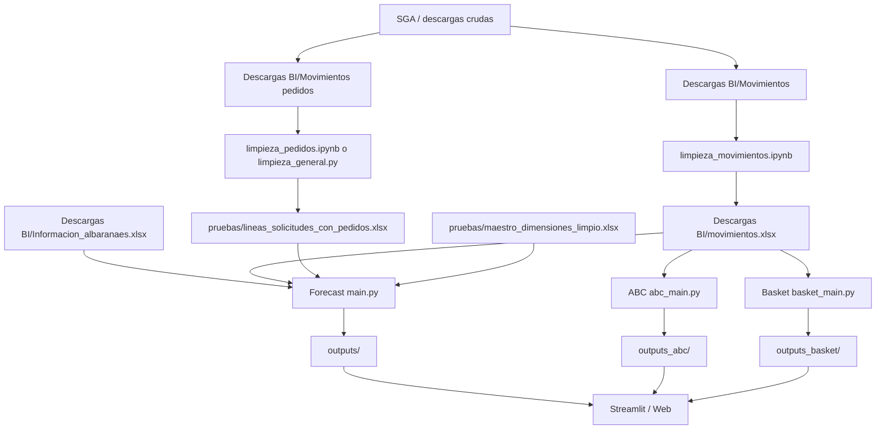
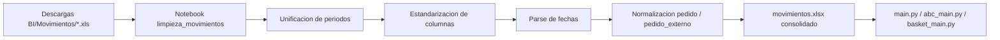
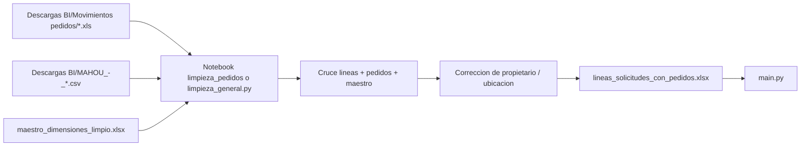
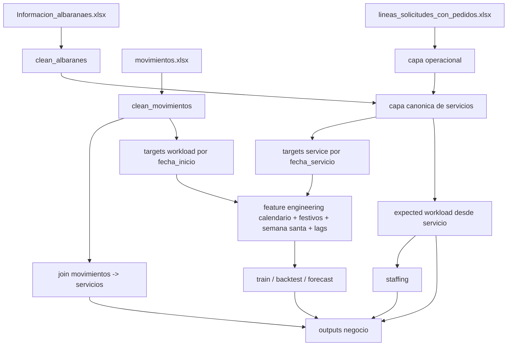
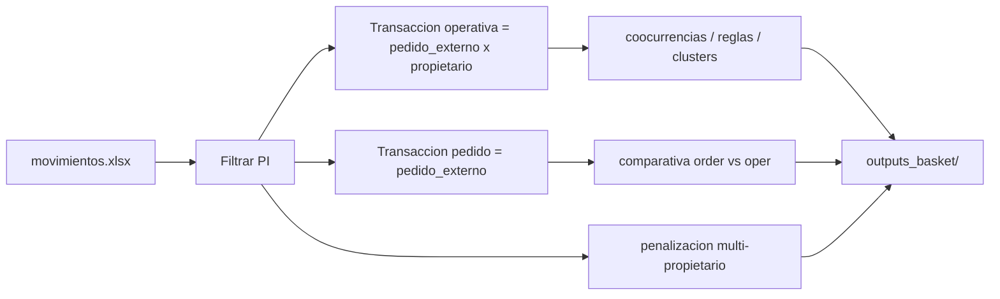

# Workflow Diario

Este documento resume el flujo real con la estructura nueva de OneDrive.

## Donde vive cada cosa

- OneDrive `pruebas/Descargas BI/Informacion_albaranaes.xlsx`
- OneDrive `pruebas/Descargas BI/movimientos.xlsx`
- OneDrive `pruebas/lineas_solicitudes_con_pedidos.xlsx`
- OneDrive `pruebas/maestro_dimensiones_limpio.xlsx`
- OneDrive `pruebas/Descargas BI/Movimientos/`
- OneDrive `pruebas/Descargas BI/Movimientos pedidos/`
- OneDrive `pruebas/Descargas BI/limpieza_movimientos.ipynb`
- OneDrive `pruebas/Descargas BI/limpieza_pedidos.ipynb`
- OneDrive `pruebas/limpieza_general.py`
- Repo `outputs/`, `outputs_abc/`, `outputs_basket/`

## Flujo completo



## Limpieza de movimientos



## Limpieza de pedidos



## Forecast



## ABC Picking

```mermaid
flowchart LR
    A["movimientos.xlsx"] --> B["Filtrar Tipo movimiento = PI"]
    B --> C["Agrupar por SKU y periodo"]
    C --> D["pick_lines / pick_qty / n_orders / n_days_active"]
    D --> E["Orden descendente por pick_lines"]
    E --> F["Pareto puro abc_pareto_class"]
    F --> G["Suelo operativo abc_class"]
    G --> H["ABC-XYZ + layout candidates"]
    H --> I["outputs_abc/ + Streamlit"]
```



## Basket Picking



## Comando diario recomendado

Sin refrescar inputs limpios:

```powershell
Set-ExecutionPolicy -Scope Process -ExecutionPolicy Bypass
.venv\Scripts\activate
python run_daily_pipeline.py
```

Refrescando primero los inputs limpios con el script externo si esta disponible:

```powershell
Set-ExecutionPolicy -Scope Process -ExecutionPolicy Bypass
.venv\Scripts\activate
python run_daily_pipeline.py --refresh_clean_inputs
```

Wrapper PowerShell:

```powershell
Set-ExecutionPolicy -Scope Process -ExecutionPolicy Bypass
.\scripts\run_daily_pipeline.ps1
```

## Logica operativa recomendada

1. Actualizar descargas en `Descargas BI`.
2. Regenerar `movimientos.xlsx` y `lineas_solicitudes_con_pedidos.xlsx` si hubo cambios crudos.
3. Lanzar `run_daily_pipeline.py`.
4. Revisar `outputs/`, `outputs_abc/` y `outputs_basket/`.
5. Abrir Streamlit o web para consumir resultados.
